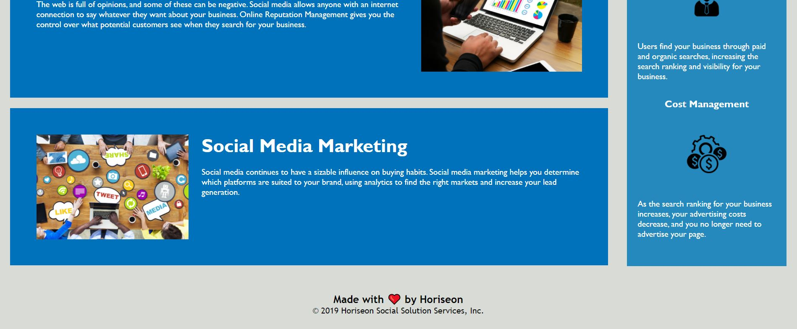

## FIRST PROJECT: HORISEON-CODE-REFACTOR 

Main purpose: :+1:
>Always write code clear and organized format.

## Description
The main purpose of this project is to figure out how to make the code clear and organized. The .html file has been organized with Semantic tag in sequential order. Most of the tags has its short comments for description.  
Also, it is able to see clearly how the website structure is made up with the basic layout. 

## Table of Contents
* [Installation](#installation)
* [Usage](#usage)
* [Credits](#credits)
* [License](#license)

## URL 
1. Deployed URL
    https://songhee95.github.io/horiseon-code-refactor/

2. Github Page URL
    [Github](https://github.com/Songhee95/horiseon-code-refactor)

## Usage

## Credits 
*SEMANTIC ELEMENT reference document link*
    https://www.w3schools.com/html/html5_semantic_elements.asp

## License
*MIT License*
Copyright (c) [2020] [SongheeYim]

Permission is hereby granted, free of charge, to any person obtaining a copy
of this software and associated documentation files (the "Software"), to deal
in the Software without restriction, including without limitation the rights
to use, copy, modify, merge, publish, distribute, sublicense, and/or sell
copies of the Software, and to permit persons to whom the Software is
furnished to do so, subject to the following conditions:

The above copyright notice and this permission notice shall be included in all
copies or substantial portions of the Software.

THE SOFTWARE IS PROVIDED "AS IS", WITHOUT WARRANTY OF ANY KIND, EXPRESS OR
IMPLIED, INCLUDING BUT NOT LIMITED TO THE WARRANTIES OF MERCHANTABILITY,
FITNESS FOR A PARTICULAR PURPOSE AND NONINFRINGEMENT. IN NO EVENT SHALL THE
AUTHORS OR COPYRIGHT HOLDERS BE LIABLE FOR ANY CLAIM, DAMAGES OR OTHER
LIABILITY, WHETHER IN AN ACTION OF CONTRACT, TORT OR OTHERWISE, ARISING FROM,
OUT OF OR IN CONNECTION WITH THE SOFTWARE OR THE USE OR OTHER DEALINGS IN THE
SOFTWARE.

    